[](https://travis-ci.org/IBM/java-microprofile-fault-monitoring)

# Build fault tolerant microservices via the MicroProfile fault-tolerant feature


This code demonstrates the deployment of a Java Open Liberty application using MicroProfile on Kubernetes. It uses [Prometheus](https://prometheus.io/) to scrape application metrics and [Grafana](https://grafana.com/) platform for analytics and monitoring. The application uses `MicroProfile Release 2.1` and focuses on `Fault Tolerant`, which is one of the features in that release.

[MicroProfile](https://microprofile.io/) is a baseline platform definition that optimizes Enterprise Java for a microservices architecture and delivers application portability across multiple MicroProfile runtimes. Since the release of MicroProfile 1.2, the metrics feature comes out-of-the-box with the platform.

The [sample application](https://github.com/IBM/sample.microservices.web-app) used is a web application for managing a conference and is based on a number of discrete microservices. The front end is written in Angular; the backing microservices are in Java. All run on Open Liberty, in Docker containers managed by Kubernetes.  It's based on a [demo application](https://github.com/eclipse/microprofile-conference) from the MicroProfile platform team.
The fork [sample application](https://github.com/IBM/sample.microservices.web-app) was converted to use Open Liberty and Microprofile Metrics which is part of Microprofile Release 2.1.

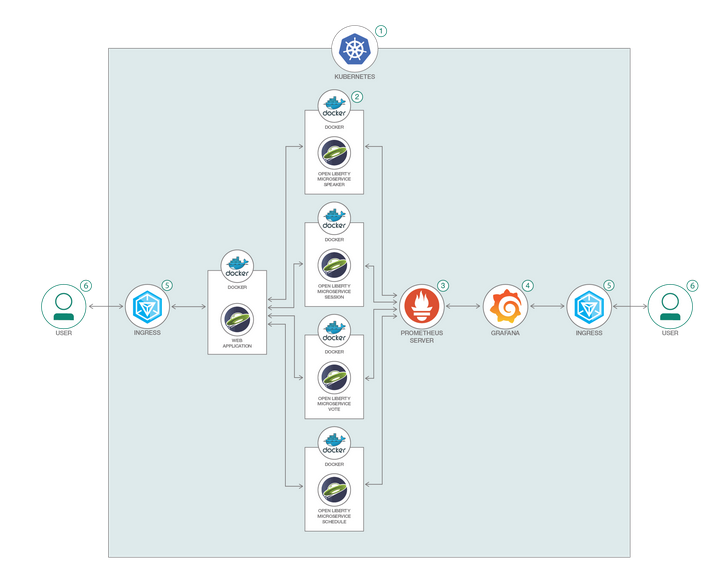

## Flow

1. Create Kubernetes service in IBM cloud.
1. Deploy all the microservices into the Kubernetes cluster.
1. Deploy Prometheus server as a service into the Kubernetes cluster.
1. Deploy Grafana as a service into the Kubernetes cluster.
1. Use ingress gateway to expose web application from the Kubernetes cluster
1. User accesses the web application through browser.

## Included Components
- [Kubernetes Cluster](https://cloud.ibm.com/docs/containers/cs_ov.html#cs_ov)
- [MicroProfile](https://microprofile.io/)
- [IBM Cloud Kubernetes Service](https://cloud.ibm.com/catalog?taxonomyNavigation=apps&category=containers)
- [Grafana](http://docs.grafana.org/guides/getting_started)
- [Prometheus](https://prometheus.io/)
- [Open Liberty - An IBM open source project](https://openliberty.io/)


## Microprofile Fault Tolerant Feature

All Microservices fail and it's is really important to create microservices which are resilient. [Eclipse MicroProfile Fault Tolerance](https://github.com/eclipse/microprofile-fault-tolerance) provides a simple, configurable and flexible solution to create a Fault Tolerant microservice. It offers the following Fault Tolerance policies:

* **Timeout**: Define a duration for timeout.
* **Retry**: Define a criteria on when to retry.
* **Fallback**: provide an alternative solution for a failed execution.
* **Bulkhead**: isolate failures in part of the system while the rest part of the system can still function.
* **CircuitBreaker**: offer a way of fail fast by automatically failing execution to prevent the system overloading and indefinite wait or timeout by the clients.
* **Asynchronous**: invoke the operation asynchronously.

The main design is to separate execution logic from execution. The execution can be configured with fault tolerance policies. Eclipse MicroProfile Fault Tolerance introduces the following annotations for the corresponding Fault Tolerance policies:

**@Timeout, @Retry, @Fallback, @Bulkhead, @CircuitBreaker, @Asynchronous**

All you need to do is to add these annotations to the methods or bean classes you would like to achieve fault tolerance.

## Using Microprofile Fault Tolerant Annotations

### @Retry
The `@Retry` annotation allows you to define a criteria on when to retry. The below example is configured to retry up to 5 times till the duration of 1000ms and when an Exception is occurred.

```java
@GET
@Path("/attendee/retries")
@Produces(APPLICATION_JSON)
@Counted(name="io.microprofile.showcase.vote.api.SessionVote.getAllAttendees.monotonic.absolute",monotonic=true,absolute=true,tags="app=vote")
@Retry(maxRetries = 5, maxDuration= 1000, retryOn = {Exception.class})
public Collection<Attendee> getAllAttendeesRetries() {
    Collection<Attendee> attendees = selectedAttendeeDAO.getAllAttendees();
    if(attendees == null){
        throw new RuntimeException("There must be attendees to run the meetings.");
    }
    return attendees;
}
```

### @Timeout
The `@Timeout` annotation allows you to define a duration for timeout. It prevents from an execution to wait for ever. In the below example the timeout is 100ms after which the method will fail with a `TimeoutException`.

```java
/**
 * Making returning of all slow schedules.
 * @return
 */
@GET
@Path("/all")
@Timed
@Metric(name="io.microprofile.showcase.schedule.resources.ScheduleResource.allSchedules.Metric",tags="app=schedule")
@Timeout(100)
public Response allSchedules() {
    final List<Schedule> allSchedules = scheduleDAO.getAllSchedules();
    final GenericEntity<List<Schedule>> entity = buildEntity(allSchedules);
    try {
        Thread.sleep(102);
    } catch (InterruptedException e) {
        return Response.status(Response.Status.NOT_FOUND).build();
    }
    return Response.ok(entity).build();
}
```

### @CircuitBreaker
The `@CircuitBreaker` annotation allows you to prevent repeating timeout so that the failing services fail fast. The below code snippet means that the circuit is open once 2 (4 * 0.5) failures which occur during the rolling window of 4 consecutive invocations. The circuit will stay open for 1000ms. The circuit will then be closed after 5 consecutive successful invocations of the method. When a circuit is open a `CircuitBreakerOpenException` will be thrown.

```
	@PUT
    @Path("/search")
    @Counted(monotonic = true,tags="app=speaker")
    @CircuitBreaker(requestVolumeThreshold=4, failureRatio=0.50, delay=1000, successThreshold=5)
    public Set<Speaker> searchFailure(final Speaker speaker) {
        if (isServiceBroken.get()) {
            throw new RuntimeException("Breaking Service failed!");
        }
        final Set<Speaker> speakers = this.speakerDAO.find(speaker);
        return speakers;
    }

```

You can combine the circuit breaker with other patterns, like the retry or the timeout. This way you can control the failures that lead to an open circuit.

```
import org.eclipse.microprofile.faulttolerance.CircuitBreaker;
import org.eclipse.microprofile.faulttolerance.Retry;
import org.eclipse.microprofile.faulttolerance.Timeout;

@CircuitBreaker(requestVolumeThreshold = 4, failureRatio = 0.75, delay = 1000, successThreshold = 10, )
@Retry(retryOn = {RuntimeException.class, TimeoutException.class}, maxRetries = 7)
@Timeout(500)
public String callSomeService() {...}

```

### @Bulkhead
If you use @Bulkhead, metrics are added for how many concurrent calls to your method are currently executing, how often calls are rejected, how long calls take to return, and how long they spend queued (if you’re also using @Asynchronous). You can use @Bulkhead in conjunction with @Asynchronous. @Asynchronous causes an invocation to be executed by a different thread. The below example shows the usage of @bulkhead annotation, indicating that only 3 concurrent requests to the API is allowed.

```
    @GET
    @Timed
    @Metric
    @Path("/getAllSpeakers")
    @Counted(name="io.microprofile.showcase.speaker.rest.monotonic.getAllSpeakers.absolute",monotonic = true,tags="app=speaker")
    @Bulkhead(3)
    public Collection<Speaker> getAllSpeakers() {
        final Collection<Speaker> speakers = this.speakerDAO.getAllSpeakers();
        speakers.forEach(this::addHyperMedia);
        return speakers;
    }
```

### @Fallback
Fallback annotation allows you to deal with exceptions. The previous annotations increases the success rate of invocation but you cannot eliminate exceptions. When an exception occurs it's wise to fall back to a different operation. A method can be annotated with @Fallback, which means the method will have Fallback policy applied. The fallback method needs to have same signature as the original method signature. @Fallback can be used in conjunction with any other annotation. The below code snippet means that when the method failed and reaches it's maximum retries, the method `fallBackMethodForFailingService` will be invoked. 

```
    @GET
    @Path("/failingService")
    @Counted(monotonic = true,tags="app=speaker")
    @Retry(maxRetries = 2)
    @Fallback(fallbackMethod = "fallBackMethodForFailingService")
    public Speaker retrieveFailingService() {
        throw new RuntimeException("Retrieve service failed!");
    }

    /**
     * Method to fallback on when you receive run time errors
     * @return
     */
    private Speaker fallBackMethodForFailingService() {
        return new Speaker();
    }
```


## Getting Started

### Kubernetes

In order to follow this guide you'll need a Kubernetes cluster. If you do not have access to an existing Kubernetes cluster then follow the instructions (in the link) for one of the following:

_Note: These instructions are tested on Kubernetes 1.10.5.  Your mileage may vary if you use a version much lower or higher than this._

* [Minikube](https://kubernetes.io/docs/setup/minikube/) on your workstation
* [IBM Cloud Kubernetes Service](https://github.com/IBM/container-journey-template#container-journey-template---creating-a-kubernetes-cluster) to deploy in an IBM managed cluster (free small cluster)
* [IBM Cloud Private - Community Edition](https://github.com/IBM/deploy-ibm-cloud-private/blob/master/README.md) for a self managed Kubernetes Cluster (in Vagrant, Softlayer or OpenStack)

After installing (or setting up your access to) Kubernetes ensure that you can access it by running the following and confirming you get version responses for both the Client and the Server:

```bash

$ kubectl version

Client Version: version.Info{Major:"1", Minor:"11", GitVersion:"v1.11.0", GitCommit:"91e7b4fd31fcd3d5f436da26c980becec37ceefe", GitTreeState:"clean", BuildDate:"2018-06-27T20:17:28Z", GoVersion:"go1.10.2", Compiler:"gc", Platform:"linux/amd64"}
Server Version: version.Info{Major:"1", Minor:"10", GitVersion:"v1.10.5+IKS", GitCommit:"7593549b33fb8ab65a9a112387f2e0f464a1ae87", GitTreeState:"clean", BuildDate:"2018-07-19T06:26:20Z", GoVersion:"go1.9.3", Compiler:"gc", Platform:"linux/amd64"}
```

## Steps

### 1. Clone Repository

First, clone our repository.

```bash
git clone https://github.com/IBM/java-microprofile-fault-monitoring.git
cd java-microprofile-fault-monitoring

```

### 2. Build and Deploy Using Kubernetes Cluster

If you want to [build the application](docs/build-instructions.md) yourself now would be a good time to do that. Please follow the rebuild steps if you'd like to re-create images with the latest available Open Liberty version. However for the sake of demonstration you can use the images that we've already built and uploaded to the journeycode Docker repository. You can find the existing images by clicking the below URL:

`https://cloud.docker.com/u/journeycode/repository/list?name=microservice-fault&namespace=journeycode&page=1`

Since this is the continuation of previous pattern, Please go through the steps 3 to 4, to deploy the application, using following link but on this repostiory.

[Build and Deploy Using Kubernetes Cluster](https://github.com/IBM/java-microprofile-metrics-on-kubernetes#3-create-kuberenetes-cluster)

At this point your app should be running. You can access the application by going to the URL:
`http://<cluster hostname/domain name >`

To access the basic and fault tolerant metrics, you need to make sure that you hit each of the endpoints. You can do that by clicking each of the links in your application so that it's hitting the endpoints in each of the microservices. For some of the endpoints if you cannot access through the application you can hit it using `curl` command. for example:

`curl http://sanjeev-cluster-mp-metrics.us-south.containers.appdomain.cloud/speaker/getAllSpeakers` will hit the endpoint where `@Bulkhead` annotation is used.


### 3. Installing Prometheus Server

> NOTE: In order for prometheus to scrape fault tolerant metrics, you should hit each of the endpoints annonated with fault tolerant annotations.  The metrics query starts with `ft_`.

Prometheus server is set up to scrape metrics from your microservices and gathers time series data which can saved in the database or can be directly fed to Grafana to visualize different metrics. The deployment yaml file [deploy-prometheus.yml](manifests/deploy-prometheus.yml) deploys the Prometheus server into the cluster which you can be accessed on port 9090 after port forwarding.
 
> NOTE: This is only for development purpose. Grafana is pre-configured to connect to Prometheus server to get metrics.

To access Prometheus server,you can port forward using the following command although it's not recommended. 

```bash
kubectl port-forward pod/<prometheus-server-pod-name>  9090:9090
```

Searching falult tolerant metrics on prometheus server:


Sample fault tolerant metrics graph for `@Bulkhead` on prometheus server:

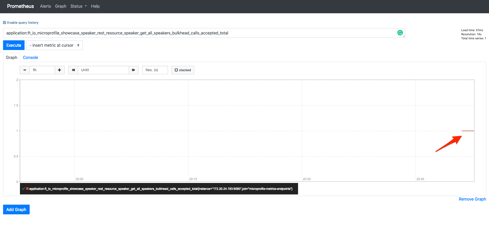

> NOTE: Exposing metrics using Prometheus server is not recommended as the metrics are not human readable.

### 4	. Installing Grafana

Grafana is a platform for analytics and monitoring. You can create different charts based on the metrics gathered by Prometheus server. The deployment yaml file [deploy-grafana.yml](manifests/deploy-grafana.yml) installs the Grafana dashboard into the cluster which you can access on port 3000 after port forwarding. To run locally you can use the following command:

```bash
kubectl port-forward pod/<grafana-pod-name>  3000:3000
```

Following are the steps to see metrics on grafana dashboard.

* Launch `http://localhost:3000` which will open up Grafana dashboard.
* Login using the default username/password which is admin/admin.
* The Grafana Dashboard is already pre-configured to connect to Prometheus database using proxy and there are two dashboards which are already pre-configured to load.

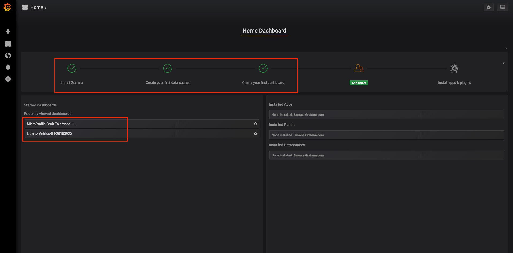

* You can also add Datasource from the grafana console.

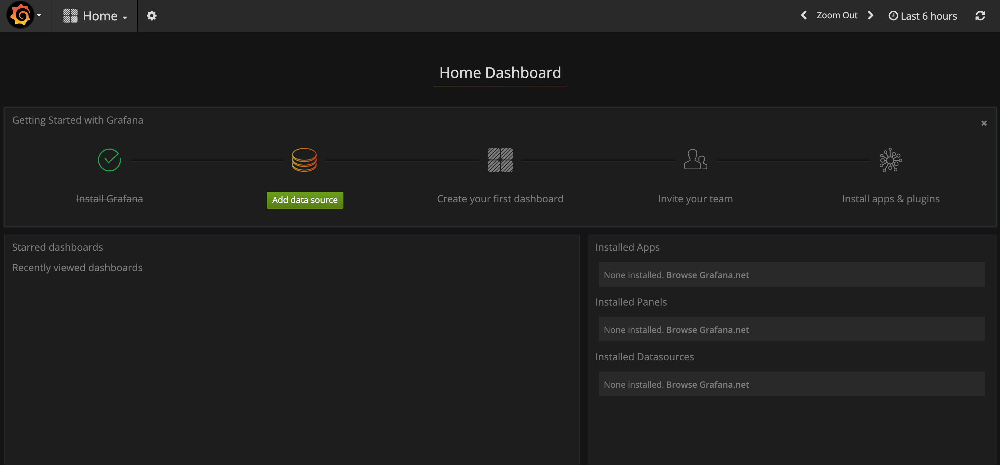

* Add Prometheus server URL.
	* Using Direct Connection: In this approach, you need to port forward the prometheus server to port 9090.
		
		```bash
			kubectl port-forward pod/<prometheus server-pod-name>  9090:9090
		```	
		
		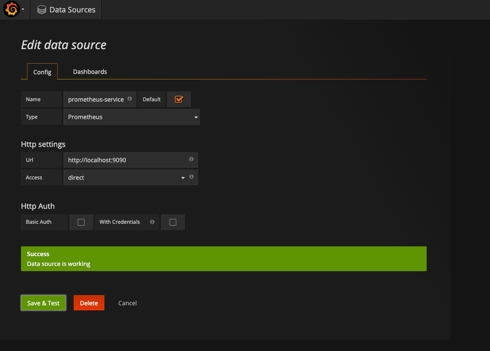
	* Using Proxy	: In this approach, you need to add `http://<prometheus service name>:<port>` as the proxy 		url.
		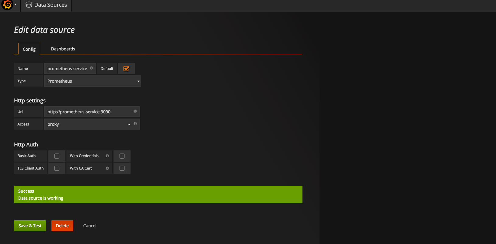

* **Getting Usage Metrics:**  	
	* The dashboards are pre-configured to load automatically. Select the dashboard that starts with name `Liberty-	Metrics...`. The charts are real time. So, as you go through the webapp clicking each link, the charts on the 	Grafana dashboard will show spikes on each chart.
	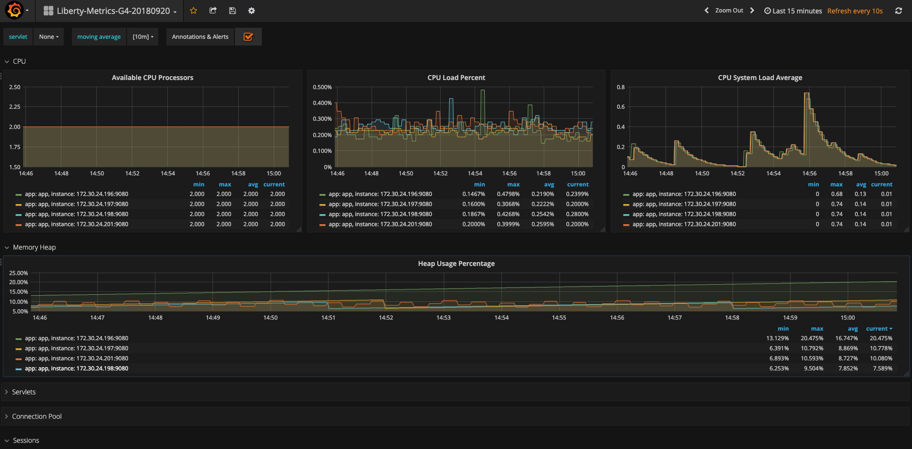
* **Getting Fault Tolerant Metrics:**  
	* Select the dashboard that starts with name `Microprofile Fault Tolerance`. You should be able to see different 	panels for each fault tolerant annotations. Going into each panel you should be able to see graphs for each 	annotations. Select the appropriate method from the `method` drop down at the top and see the graphs on the 	annotation panel that is associate with this method.
	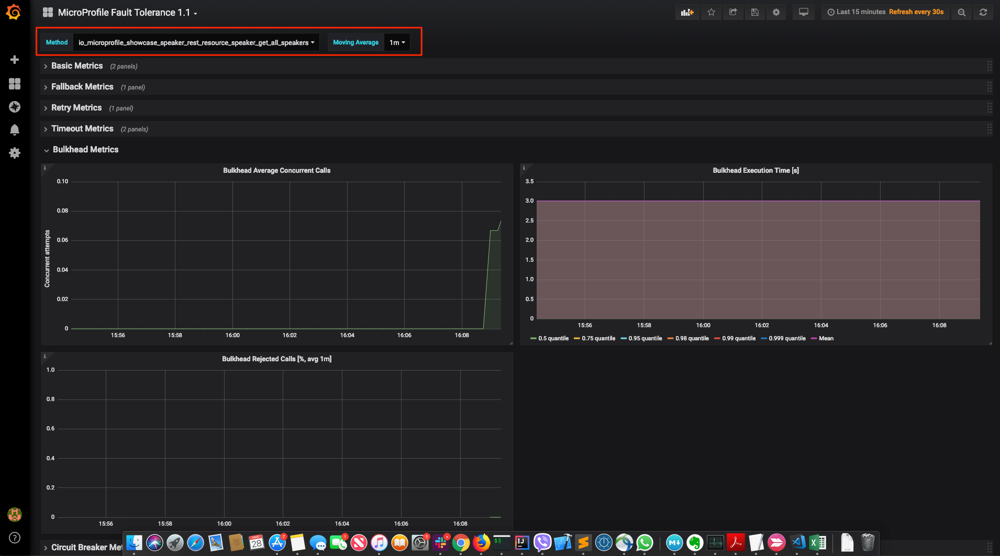 
	
	> NOTE: Each row represents different fault tolerant annonations with multiple panels to show graphs for 	different metrics.

## Sample Output

### @Timeout

When @Timeout annotation is used, it results in timeout if it takes longer than the time specified which in this case is 3 seconds.

```
@POST
    @Counted(monotonic = true,tags="app=schedule")
    @Timeout(3000)
    public Response add(final Schedule schedule) {
        final Schedule created = scheduleDAO.addSchedule(schedule);
        return Response.created(URI.create("/" + created.getId()))
                .entity(created)
                .build();
    }
```

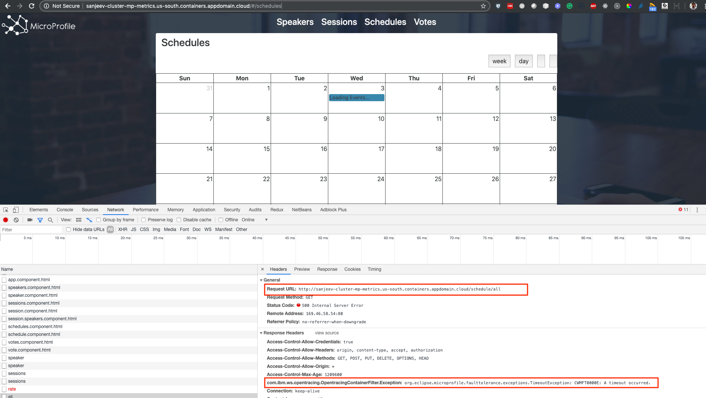

If @Timeout was not used it would take long and eventually give you an output or the application times out.

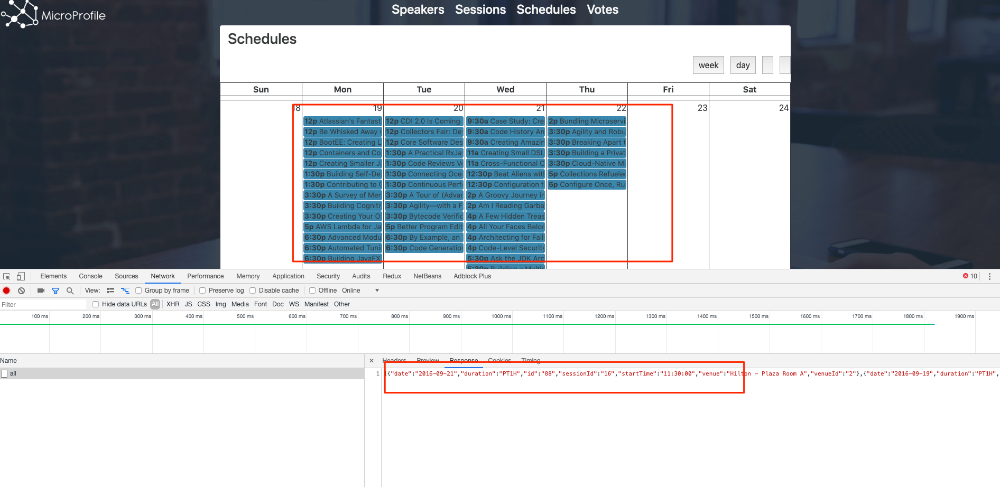

### @Bulkhead

When @Bulkhead is used, the number specified is the most thread allowed to access the API. For example if its used with value 3 it results in BulkException. [Apache Jmeter](https://jmeter.apache.org/) is used to call multiple threads on the API.

```
@GET
    @Timed
    @Metric
    @Counted(name="io.microprofile.showcase.speaker.rest.monotonic.retrieveAll.absolute",monotonic = true,tags="app=speaker")
    @Bulkhead(value = 3)
    public Collection<Speaker> retrieveAll() {
        final Collection<Speaker> speakers = this.speakerDAO.getSpeakers();
        speakers.forEach(this::addHyperMedia);
        return speakers;
    }

```


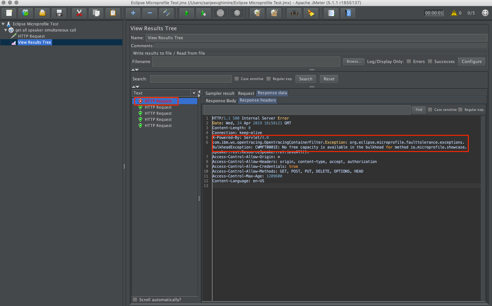

For multiple thread calls to the API within the limit specified in Bulkhead, it would pass through and gives you the results back.

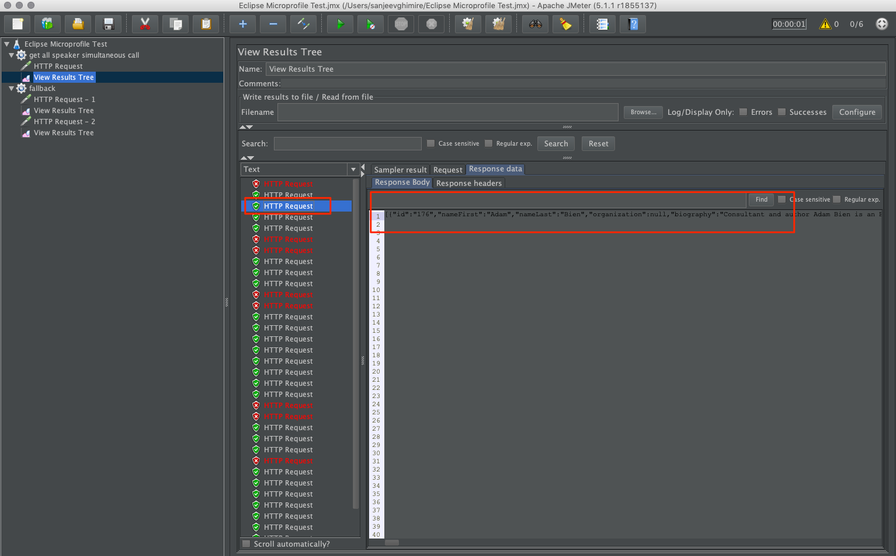


### @Fallback

When @Fallback is used, even though the method throws runtime exception, the exception is logged and it falls back to another method that returns a proper response back to the user which in this case is a empty `Speaker` object.

```
@GET
    @Path("/failingService")
    @Counted(monotonic = true,tags="app=speaker")
    @Fallback(fallbackMethod = "fallBackMethodForFailingService")
    public Speaker retrieveFailingService() {
        throw new RuntimeException("Retrieve service failed!");
    }

    /**
     * Method to fallback on when you receive run time errors
     * @return
     */
    private Speaker fallBackMethodForFailingService() {
        return new Speaker();
    }   
 
```
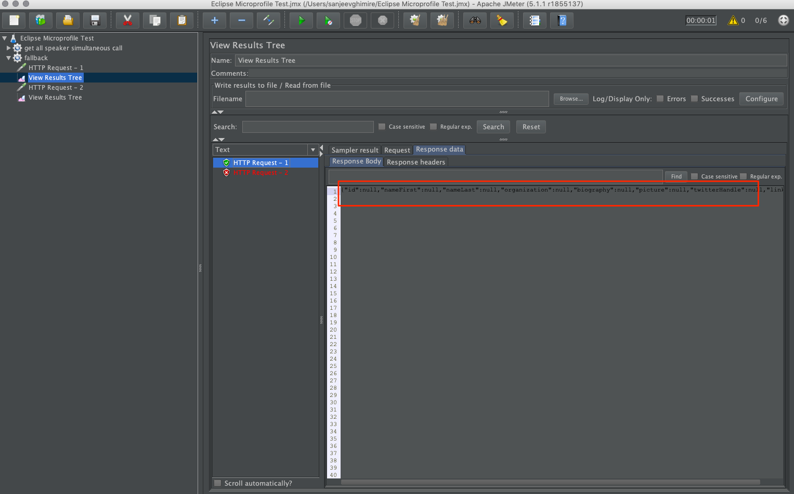

If the @Fallback was not used it would result in `500 internal server error`.

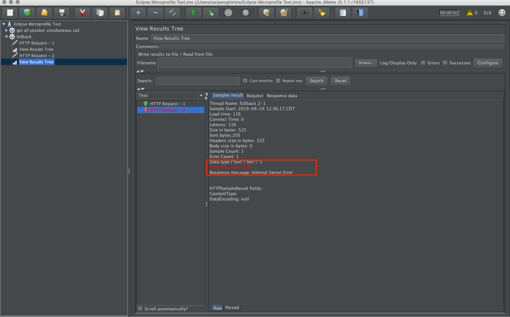


## Troubleshooting

* If your microservice instance is not running properly, you may check the logs using
	* `kubectl logs <your-pod-name>`
* To delete a microservice
	* `kubectl delete -f manifests/<microservice-yaml-file>`
* To delete all microservices
	* `kubectl delete -f manifests`
* You can also see kail logs using command:
	* `kubectl run -it --rm -l kail.ignore=true --restart=Never --image=abozanich/kail kail-default -- --ns default`

## References
* This Java microservices example is based on Kubernetes [Microprofile Showcase Application](https://github.com/WASdev/sample.microservices.docs).

## License

This code pattern is licensed under the Apache Software License, Version 2.  Separate third party code objects invoked within this code pattern are licensed by their respective providers pursuant to their own separate licenses. Contributions are subject to the [Developer Certificate of Origin, Version 1.1 (DCO)](https://developercertificate.org/) and the [Apache Software License, Version 2](https://www.apache.org/licenses/LICENSE-2.0.txt).

[Apache Software License (ASL) FAQ](https://www.apache.org/foundation/license-faq.html#WhatDoesItMEAN)
